<picture>
  <source media="(prefers-color-scheme: dark)" srcset="banner-dark.svg">
  <source media="(prefers-color-scheme: light)" srcset="banner-light.svg">
  
</picture>

PhD candidate at TU Clausthal, finishing a dissertation on the **Vehicle Platooning Problem**: coordinating truck routes and schedules so vehicles form fuel-saving convoys on real road networks. I work on both sides of the methodology — exact optimization (MILP with Gurobi) and metaheuristics — and benchmark them against each other at scale. Seven years of university teaching and thesis supervision alongside the research.

What I care about: clean mathematical models, reproducible experiments, and code that separates the problem from the algorithm.

## Methods

- **Exact optimization** — MILP modeling, Benders decomposition, two-stage stochastic programming (SAA), chance constraints · Gurobi, CPLEX, HiGHS, SCIP
- **Metaheuristics** — GA, SA, PSO, ACO, CMA-ES; multi-objective: NSGA-II, MOPSO, SPEA2, PESA-II, MOEA/D — built as reusable, problem-agnostic engines
- **ML × OR** — deep learning foundations (DeepLearning.AI specialization); currently building LLM-assisted optimization workflows

## Selected repositories

| Repository | Summary |
|---|---|
| [multi-objective-vehicle-platooning-problem](https://github.com/hajibabaie/multi-objective-vehicle-platooning-problem) | Joint route and speed selection for truck platooning — six multi-objective metaheuristics benchmarked against the exact Pareto front of a MILP solved with Gurobi. The core problem of my PhD. |
| [multi-objective-scheduling](https://github.com/hajibabaie/multi-objective-scheduling) | Energy-aware tri-objective flow-shop & job-shop scheduling (makespan, tardiness, energy) on the Taillard benchmarks — NSGA-II, MOEA/D, and MOPSO from scratch with adaptive operator selection, Dockerized PostgreSQL experiment tracking, and a full nonparametric statistical comparison. |
| [stochastic-facility-location](https://github.com/hajibabaie/stochastic-facility-location) | Two-stage stochastic capacitated facility location with SAA, a service-level chance constraint, and Benders decomposition. Solver-agnostic backends (HiGHS / SCIP / Gurobi). |
| [multi-objective-optimization](https://github.com/hajibabaie/multi-objective-optimization) | NSGA-II, MOPSO, SPEA2, PESA-II, and MOEA/D implemented from scratch and compared on benchmark problems. |
| [genetic-algorithm](https://github.com/hajibabaie/genetic-algorithm) | Problem-agnostic GA engine with pluggable encodings (binary, real, permutation, mixed), applied to classic OR problems. |
| [ant-colony-optimization](https://github.com/hajibabaie/ant-colony-optimization) | ACO for discrete and continuous optimization on a shared metaheuristic core. |

## Stack

## Contact

[LinkedIn](https://www.linkedin.com/in/mo-hajibabaie) · Germany · Open to OR Scientist / Applied Scientist roles
